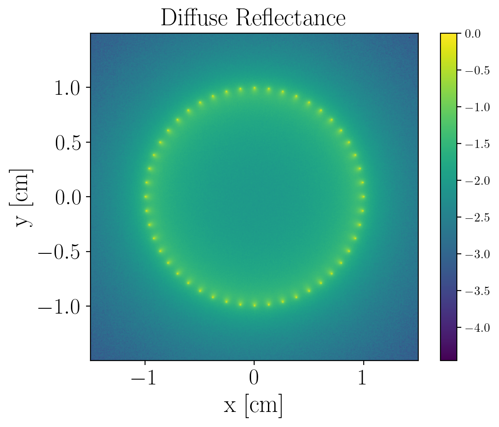

# Oblique Incidence Monte Carlo

This code simulates an obliquely incident photon source (pencil
beam) on a scattering medium. It can simulate one incident point
source or many.



## Configuration

Configuration is changed by copying `config.def.h` to `config.h`
and editing it. This configuration is then baked into the compiled
binary. This helps the compiler optimize for the binary for a
faster runtime and keeps the types of configuration variables
clear.

## Building

After copying over and editing `config.h` the program can be
compiled by running:

```
./build.sh
```

## Running

The compiled program can be run as:

```
./mc output_filename_prefix
```

Currently directories in `output_filename_prefix` are not checked
for existence prior to running so the program will fail to save
the output if you don't ensure this yourself.

## Citations

If you intend on using this as a basis for any published works a
citation, while not required, would be appreciated 🙂!
